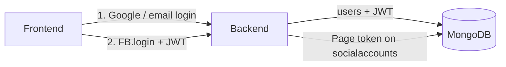

# Architecture

## System overview

```
┌─────────────┐      ┌──────────────────┐      ┌────────────────┐
│  Next.js 14 │──────▶  Express API GW  │──────▶  Flask AI svc   │
│  (frontend) │◀──────│  (backend)       │◀──────│  (ai-service)  │
└─────────────┘      └────────┬─────────┘      └────────┬────────┘
                               │                          │
                               ▼                          ▼
                     ┌──────────────────┐          ┌──────────┐
                     │ MongoDB          │          │  Groq /  │
                     │ users, accounts, │          │  OpenAI  │
                     │ drafts, posts    │          └──────────┘
                     └────────┬─────────┘
                               │
                               ▼
                     ┌──────────────────────┐
                     │ Meta Graph API        │
                     │ (Facebook + Instagram)│
                     │ or sandbox simulator  │
                     └──────────────────────┘
```

## Auth and social-account connect

App login and Meta account linking are two hops through the same three
blocks. Google (or email) signs the user into SteadyPost; Meta never does.
The JWT from hop 1 is what authorizes hop 2.



1. The frontend signs the user in (Google authorization-code OAuth, or
   email/password). The backend writes the **user** and issues JWTs
   (access 15m, refresh 7d). Tokens live in `localStorage`.
2. With that JWT, the frontend runs Facebook Login for Business
   (`FB.login({ config_id })` in [`frontend/lib/facebookSdk.js`](../frontend/lib/facebookSdk.js)).
   The backend lists Pages via Graph (`/me/accounts`, `/me/businesses`,
   `/{business}/owned_pages`), then stores the **Page access token** on
   `socialaccounts`. A linked Instagram Business account is saved as a
   second row using the same Page token. The browser never sees that token
   (`isLive` is sent instead).

Google login: `GET /api/v1/auth/oauth/google` → Google →
`GET /api/v1/auth/oauth/google/callback` → redirect to `/auth/callback`
with SteadyPost JWTs.

Meta connect: `POST /api/v1/auth/oauth/meta/pages` then
`POST /api/v1/auth/oauth/meta/connect`. Requires a live JWT plus
`NEXT_PUBLIC_META_APP_ID` / `NEXT_PUBLIC_META_LOGIN_CONFIG_ID`. Without
those, the UI can still attach a sandbox account with no token.

## Data layer

Users, social accounts, content drafts, and publish-status records live in
MongoDB (`MONGODB_URI`), via the Mongoose models under
[`backend/src/models/`](../backend/src/models/). A demo user, two sandbox
social accounts, and a sample draft are seeded once at boot
([`backend/src/data/seed.js`](../backend/src/data/seed.js)) if they do not
already exist.

The publish *job* itself is still in-process (`setImmediate` in
`src/queue/`) — there is no Redis/Bull. Restarting the backend does not
wipe MongoDB, but it does drop any publish job that was mid-flight.

## Publishing engine flow

1. User hits `/publish/now` with a `contentDraftId`, `platform`, and
   optional `socialAccountId`.
2. Backend looks up the draft, inserts a `scheduledposts` row with status
   `publishing`, and schedules an in-process publish job (`src/queue/`)
   with zero delay.
3. The same backend process picks up the job via `setImmediate` and
   dispatches to the platform-specific publisher
   (`src/services/publishers/metaPublisher.js`).
4. `metaPublisher` calls the real Facebook/Instagram Graph API only if
   `META_APP_ID` is set *and* a `socialAccountId` is provided; otherwise
   ("sandbox mode") it simulates a successful publish and returns a fake
   external post ID. Live publishes use the stored Page access token.
5. The job processor writes the result (`published`/`failed`,
   `externalPostId`, `errorMessage`) back onto the same `scheduledposts`
   row, which `/publish/status/:id` reads back.

Because the job delay is zero, this flow is really "publish now" with an
async-shaped API — there's no scheduled/delayed publishing exposed in the
UI or API.

## AI microservice boundary

The AI service is deliberately isolated from the core backend:
- Different language/runtime (Python) suits the LLM ecosystem (OpenAI-
  compatible SDK against Groq) better than Node.
- It's a stateless request/response service — no data store, no shared
  state with the backend.
- The Express backend proxies all AI calls (`/api/v1/ai/*`) rather than the
  frontend calling the AI service directly, keeping JWT auth and rate
  limiting in one place.
- Two independent fallback layers exist so the demo never hard-fails: the
  AI service itself falls back to a template generator if no
  `GROQ_API_KEY`/`OPENAI_API_KEY` is set, and the backend's `ai.controller.js`
  falls back to its own built-in generator if the AI service is unreachable
  at all.

## Media uploads

`POST /api/v1/content/media` accepts one image or video file (multer,
in-memory buffer, 25MB limit) and returns it as a base64 `data:` URL. There
is no object storage — the encoded file is only ever held in the browser's
state and the request/response cycle. This is why media doesn't survive a
page refresh: it was never written anywhere durable.

## Known limitations (intentional at this stage)

- No object storage for uploaded media (base64 in memory only).
- Publish jobs are in-process only; a backend restart drops in-flight
  publishes (MongoDB rows survive).
- Sandbox social accounts (no Page token) cannot hit the real Graph API.
- Only Facebook and Instagram are supported anywhere in the app (AI
  generation, publish destinations).
- No test suites yet beyond CI placeholders.
